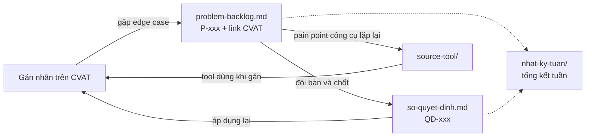

# Đội P-011 — Cohort 4A

Repo làm việc của đội P-011 cho các bài gán nhãn CVAT. Repo lưu phân công và tiến độ theo tuần,
edge case chưa rõ guideline, các quyết định đã chốt, và source code công cụ hỗ trợ nếu đội phát
triển tool.

## Có gì trong repo

| Đường dẫn | Dùng để | Cập nhật khi nào |
|---|---|---|
| [`nhat-ky-tuan/`](nhat-ky-tuan/) | Ai giữ vị trí nào, được phân công job nào, xong tới đâu | Đầu tuần phân công, cuối tuần chốt |
| [`problem-backlog.md`](problem-backlog.md) | Edge case gặp khi gán nhãn mà guideline chưa trả lời được, kèm link CVAT | **Ngay khi gặp** |
| [`so-quyet-dinh.md`](so-quyet-dinh.md) | Những gì đội đã chốt, và vì sao | Mỗi lần chốt một vấn đề |
| [`source-tool/`](source-tool/) | Source code công cụ đội tự viết để gỡ pain point khi gán nhãn | Khi đã xác định được pain point đáng làm tool |

## Các file nối với nhau thế nào

## Thành viên

| Thành viên | Mã học viên | GitHub | Vị trí |
|---|---|---|---|
| Trịnh Quang Trung | 2A202602096 | [@toilatrung](https://github.com/toilatrung) | Lead chính · Annotator · Reviewer |
| Trần Đức Thọ | 2A202602324 | Chưa cung cấp | Lead phụ · Annotator · Reviewer |
| Nguyễn Xuân Việt Anh | 2A202602102 | [@Vietanhhhhhh2003](https://github.com/Vietanhhhhhh2003) | Annotator · Reviewer |
| Nguyễn Đức Hà | 2A202602105 | Chưa cung cấp | Annotator · Reviewer |
| Lê Ngọc Nam | 2A202602060 | [@duy12345-6789](https://github.com/duy12345-6789) | Annotator · Reviewer |

| Vị trí | Việc chính |
|---|---|
| **Lead chính — Trịnh Quang Trung** | Điều phối task SEGMENTATION: chia job, đưa edge case ra bàn và chốt, giữ sổ quyết định |
| **Lead phụ — Trần Đức Thọ** | Điều phối các task BBOX: chia job, đưa edge case ra bàn và chốt |
| **Annotator** | Gán nhãn theo guideline; gặp chỗ guideline không trả lời được thì ghi vào backlog thay vì tự đoán |
| **Reviewer** | Kiểm job đã gán, trả lại chỗ sai kèm lý do |

Một người có thể giữ nhiều vị trí, nhưng **không review job do chính mình gán**.

## Dữ liệu đang thực hiện

- [Task 130 — W1-BBOX-G2-T1](https://cvat.note.transformerlabs.ai/tasks/130): jobs 1370, 1372, 1374, 1376.
- [Task 184 — W1-SEG-G2-T1](https://cvat.note.transformerlabs.ai/tasks/184): jobs 1586, 1587, 1589, 1591.
- Phân công theo job, trạng thái annotate/review từng tuần: [`nhat-ky-tuan/tuan-01.md`](nhat-ky-tuan/tuan-01.md).

## Quy ước

- **Mã**: `P-001`, `QĐ-001`, đánh số tăng dần. Không dùng lại số của mục đã bỏ.
- **Nhắc người**: bằng GitHub handle khi đã có; nếu chưa có thì ghi đầy đủ họ tên.
- **Link CVAT**: trỏ tới đúng job và thêm `?frame=<n>` khi xác định được frame có vấn đề, không trỏ tới cả task.
- **Mục guideline**: ghi số mục (`§3.2`) để ai cũng tra lại được.
- Không tự chốt edge case khi guideline chưa rõ; ghi backlog và chờ Lead/reviewer thống nhất.
